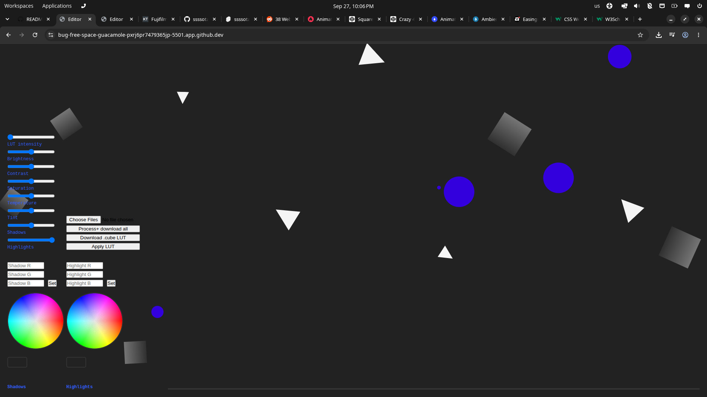

coming to a browser near you soon...
# WebLUT

Online, upload-free LUT batch editor

## Description
WebLUT is a simple, easy-to-use photo editor. It runs fully locally, in your own browser. It creates 33pt .CUBE LUTs, and batch edits your photos. It is fairly potato freindly, and can probably run on a chromebook. Credit to ANIME for the animation library and @pleasedonotdisturb on codepen for the bg. 
### Screenshots

## Getting Started

* Head to https://moocow-web.github.io/WebLUT/
* Press "Choose Files", and select your images
* Then click "Apply LUT". This will update your image preview
* Adjust you settings, and click apply LUT to update the preview
* To export LUT, press "Download .cube LUT" 
* To export .zip of images, click "Process+ Download all"

### Dependencies

* Modern browser
* JS enabled

### Installing

Site is live at https://moocow-web.github.io/WebLUT/

### Executing program

Site is live at https://moocow-web.github.io/WebLUT/

## Help

* If it fails to process your photo, this is likely because it is an unsupported format.
* If any thing else goes wrong, try restarting your browser.

## License

CC0 1.0 Universal Public Domain